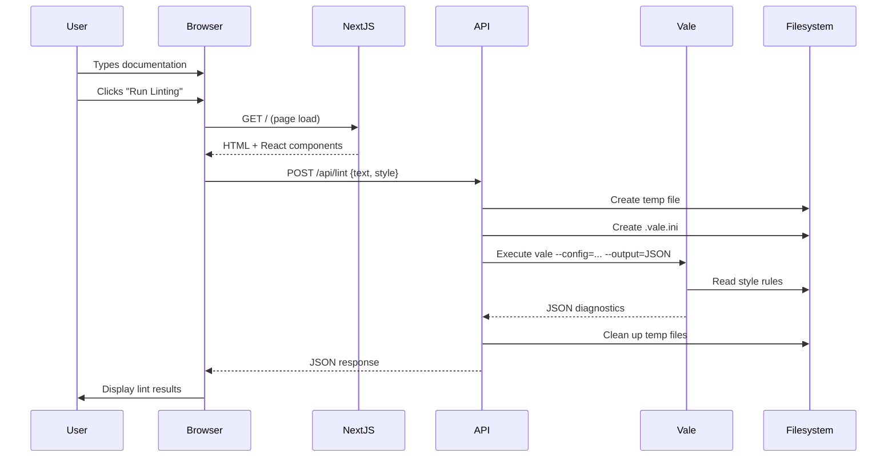

## System Overview

Verbalize is a **Next.js 16** application using the **App Router** architecture. It provides a web-based interface for linting technical documentation using the Vale CLI.

## Tech Stack

### Core Technologies

| Component | Technology | Version | Purpose |
|-----------|-----------|---------|----------|
| **Framework** | Next.js (App Router) | 16.1.6 | Server-side rendering, API routes |
| **Language** | TypeScript | 5.x | Type-safe development |
| **UI Library** | React | 19.2.3 | Component-based UI |
| **Styling** | Tailwind CSS | 4.x | Utility-first styling |
| **Icons** | Lucide React | 0.563.0 | Icon system |
| **Markdown** | react-markdown | 10.1.0 | Markdown rendering |
| **Theme** | next-themes | 0.4.6 | Dark mode support |
| **Linter** | Vale CLI | 3.9.5 | Prose linting engine |
| **Testing** | Playwright | 1.58.1 | E2E testing |

### Why These Choices?

<AccordionGroup>
  <Accordion title="Next.js App Router">
    - **Server Components**: Reduce JavaScript bundle size
    - **API Routes**: Built-in backend without separate server
    - **File-based Routing**: Intuitive project structure
    - **Optimized Builds**: Automatic code splitting and optimization
    - **Netlify Deployment**: Seamless serverless function integration
  </Accordion>

  <Accordion title="TypeScript">
    - **Type Safety**: Catch errors at compile time
    - **Better DX**: Autocomplete and inline documentation
    - **Refactor Confidence**: Rename and restructure safely
    - **Interface Definitions**: Clear data contracts
  </Accordion>

  <Accordion title="Tailwind CSS">
    - **Rapid Development**: Pre-built utility classes
    - **Consistent Design**: Design system in CSS
    - **Dark Mode**: Built-in dark mode support
    - **Small Bundle**: Purged unused styles in production
  </Accordion>

  <Accordion title="Vale CLI">
    - **Industry Standard**: Widely adopted in tech writing
    - **Extensible**: Custom rules and style guides
    - **Fast**: Written in Go for performance
    - **Offline Capable**: No external API dependencies
  </Accordion>
</AccordionGroup>

## Application Architecture

### Request-Response Flow



### Data Flow Details

<Steps>
  <Step title="Client Input">
    User enters text in the editor (`app/page.tsx`):
    ```typescript
    const [text, setText] = useState('');
    const [style, setStyle] = useState('Google');
    ```
  </Step>

  <Step title="API Request">
    Browser sends POST request to `/api/lint`:
    ```typescript
    const response = await fetch('/api/lint', {
      method: 'POST',
      headers: { 'Content-Type': 'application/json' },
      body: JSON.stringify({ text, style, customRules })
    });
    ```
  </Step>

  <Step title="Server Processing">
    API route validates input and prepares Vale execution (`app/api/lint/route.ts`):
    ```typescript
    // Validate input
    if (text.length > MAX_TEXT_LENGTH) {
      return NextResponse.json({ error: 'Text too large' }, { status: 400 });
    }
    
    // Create temporary file
    const tmpDir = await fs.mkdtemp(path.join(os.tmpdir(), 'vale-'));
    const tmpFile = path.join(tmpDir, 'doc.md');
    await fs.writeFile(tmpFile, text);
    ```
  </Step>

  <Step title="Vale Execution">
    Vale CLI processes the document:
    ```typescript
    const valePath = path.join(process.cwd(), 'vale');
    const { stdout } = await execFileAsync(
      valePath,
      [`--config=${iniFile}`, '--output=JSON', tmpFile]
    );
    const results = JSON.parse(stdout);
    ```
  </Step>

  <Step title="Response & Cleanup">
    API returns diagnostics and cleans up:
    ```typescript
    return NextResponse.json(results[tmpFile] || []);
    // finally block cleans up temp files
    await fs.rm(tmpDir, { recursive: true, force: true });
    ```
  </Step>

  <Step title="Client Rendering">
    UI displays linting alerts:
    ```typescript
    const [results, setResults] = useState<ValeAlert[]>([]);
    setResults(data);
    // Render alert cards in results panel
    ```
  </Step>
</Steps>

## Directory Structure

### Project Layout

```
verbalize/
├── app/                          # Next.js App Router
│   ├── api/                      # API routes
│   │   └── lint/
│   │       └── route.ts          # Vale integration endpoint
│   ├── layout.tsx                # Root layout (providers)
│   ├── page.tsx                  # Main UI component
│   └── globals.css               # Global styles
├── styles/                       # Vale style guides
│   ├── Google/                   # Google style rules
│   │   ├── meta.json
│   │   ├── Acronyms.yml
│   │   ├── Headings.yml
│   │   └── ...
│   ├── Microsoft/                # Microsoft style rules
│   └── RedHat/                   # Red Hat style rules
├── scripts/
│   └── install-vale.js           # Vale binary installer
├── tests/
│   ├── e2e.spec.ts              # End-to-end tests
│   └── verify_ui_improvements.spec.ts
├── public/
│   └── example-style.yml         # Example custom rule
├── .vale.ini                     # Vale configuration
├── playwright.config.ts          # Test configuration
├── tailwind.config.ts            # Tailwind configuration
├── tsconfig.json                 # TypeScript configuration
├── next.config.js                # Next.js configuration
├── package.json                  # Dependencies
└── vale (or vale.exe)           # Vale binary (auto-installed)
```

### Key Files Explained

<Tabs>
  <Tab title="app/page.tsx">
    **Main UI Component** (482 lines)

    The single-page application interface with:
    - Editor panel (textarea for input)
    - Preview panel (markdown rendering)
    - Results panel (linting alerts)
    - Settings sidebar (style selection, custom rules)
    - Theme toggle (light/dark mode)

    Key features:
    ```typescript
    // State management
    const [text, setText] = useState('');
    const [results, setResults] = useState<ValeAlert[]>([]);
    const [loading, setLoading] = useState(false);
    
    // Synchronized scrolling
    const handleScroll = (e) => {
      // Sync editor and preview scroll positions
    };
    
    // Alert click navigation
    const handleAlertClick = (alert) => {
      // Jump to issue in editor
    };
    ```
  </Tab>

  <Tab title="app/api/lint/route.ts">
    **Vale Integration API** (151 lines)

    Server-side Vale execution with:
    - Input validation (size limits, allowed styles)
    - Temporary file management
    - Custom rule handling
    - Vale CLI execution
    - Error handling and cleanup

    Security features:
    ```typescript
    // Whitelist allowed styles
    const ALLOWED_STYLES = ['Google', 'Microsoft', 'RedHat'];
    
    // Size limits
    const MAX_TEXT_LENGTH = 1024 * 1024; // 1MB
    const MAX_CUSTOM_RULES = 10;
    const MAX_RULE_LENGTH = 10 * 1024; // 10KB
    
    // Path traversal prevention
    const baseName = path.basename(ruleName);
    const safeRuleName = baseName.replace(/[^a-zA-Z0-9._-]/g, '_');
    ```
  </Tab>

  <Tab title="scripts/install-vale.js">
    **Automated Vale Installer** (60 lines)

    Downloads and extracts Vale binary:
    - Platform detection (Linux, macOS, Windows)
    - Architecture detection (x64, arm64)
    - GitHub release download
    - Extraction and permissions
    - Graceful error handling

    ```javascript
    const VERSION = '3.9.5';
    const url = `https://github.com/errata-ai/vale/releases/download/v${VERSION}/${filename}`;
    
    // Download with curl
    execSync(`curl -L "${url}" -o "${tmpFile}"`);
    
    // Extract
    execSync(`tar -xzf "${tmpFile}" ${targetBinary}`);
    
    // Make executable (Unix)
    fs.chmodSync(path.join(process.cwd(), targetBinary), 0o755);
    ```
  </Tab>

  <Tab title=".vale.ini">
    **Vale Configuration**

    Defines linting behavior:
    ```ini
    StylesPath = styles
    MinAlertLevel = suggestion
    
    [*.md]
    BasedOnStyles = Google, Microsoft
    ```

    Configuration is dynamically generated per request to support:
    - Different style guide selection
    - Custom user rules
    - Temporary style directories
  </Tab>
</Tabs>

## Component Architecture

### UI Component Breakdown

The main UI (`app/page.tsx`) is organized as a single-file component with:

```typescript
export default function Home() {
  // State Management
  const [text, setText] = useState('');
  const [style, setStyle] = useState('Google');
  const [customRules, setCustomRules] = useState<CustomRule[]>([]);
  const [results, setResults] = useState<ValeAlert[]>([]);
  const [loading, setLoading] = useState(false);
  const [sidebarOpen, setSidebarOpen] = useState(true);
  
  // Theme (next-themes)
  const { theme, setTheme } = useTheme();
  
  // Refs for direct DOM access
  const editorRef = useRef<HTMLTextAreaElement>(null);
  const previewRef = useRef<HTMLDivElement>(null);
  
  // Event Handlers
  const handleLint = async () => { /* ... */ };
  const handleScroll = (e) => { /* ... */ };
  const handleAlertClick = (alert) => { /* ... */ };
  
  return (
    <div className="flex h-screen">
      <aside>{/* Settings Sidebar */}</aside>
      <main>
        <header>{/* Top bar */}</header>
        <div className="grid grid-cols-3">
          <section>{/* Editor */}</section>
          <section>{/* Preview */}</section>
          <section>{/* Results */}</section>
        </div>
      </main>
    </div>
  );
}
```

### Design Patterns

<CardGroup cols={2}>
  <Card title="Controlled Components" icon="sliders">
    All inputs are controlled by React state:
    ```typescript
    <textarea
      value={text}
      onChange={(e) => setText(e.target.value)}
    />
    ```
  </Card>

  <Card title="Optimistic UI" icon="bolt">
    Show loading states immediately:
    ```typescript
    setLoading(true);
    await fetch('/api/lint', ...);
    setLoading(false);
    ```
  </Card>

  <Card title="Error Boundaries" icon="shield-check">
    Graceful error handling:
    ```typescript
    try {
      const response = await fetch(...);
      if (!response.ok) throw new Error();
    } catch (error) {
      alert('Failed to lint');
    }
    ```
  </Card>

  <Card title="Synchronized State" icon="arrows-rotate">
    Editor and preview scroll together:
    ```typescript
    const percentage = source.scrollTop / 
      (source.scrollHeight - source.clientHeight);
    target.scrollTop = percentage * 
      (target.scrollHeight - target.clientHeight);
    ```
  </Card>
</CardGroup>

## Vale Integration

### How Vale Works

<Steps>
  <Step title="Configuration Loading">
    Vale reads `.vale.ini` to determine:
    - Style guides to apply
    - Minimum alert level
    - File type associations
  </Step>

  <Step title="Rule Evaluation">
    For each file, Vale:
    - Parses the document structure
    - Applies rules from enabled style guides
    - Generates diagnostics (line, column, message, severity)
  </Step>

  <Step title="Output Generation">
    Vale outputs JSON with structure:
    ```json
    {
      "doc.md": [
        {
          "Action": { "Name": "", "Params": null },
          "Span": [8, 18],
          "Check": "Google.WordList",
          "Description": "",
          "Link": "https://...",
          "Message": "Use 'drop-down list' instead of 'dropdown'.",
          "Severity": "warning",
          "Match": "dropdown",
          "Line": 1
        }
      ]
    }
    ```
  </Step>
</Steps>

### Custom Rules Support

Users can upload custom Vale rules (`.yml` files):

```yaml example-rule.yml
extends: existence
message: "Avoid using '%s'"
level: error
ignorecase: true
tokens:
  - extremely
  - very
```

The API dynamically creates a `Custom` style:
```typescript
// Create Custom style directory
const customStyleDir = path.join(tempStylesDir, 'Custom');
await fs.mkdir(customStyleDir, { recursive: true });

// Add meta.json
await fs.writeFile(path.join(customStyleDir, 'meta.json'), JSON.stringify({
  name: 'Custom',
  description: 'User-uploaded rules',
  feed: ''
}));

// Write rule files
for (const rule of customRules) {
  await fs.writeFile(
    path.join(customStyleDir, rule.name),
    rule.content
  );
}

// Update .vale.ini
BasedOnStyles = ${style}, Custom
```

## Performance Considerations

### Optimization Strategies

<Tabs>
  <Tab title="Client-Side">
    - **Code Splitting**: Next.js automatically splits by route
    - **React 19**: Improved rendering performance
    - **Tailwind Purging**: Remove unused CSS in production
    - **Debounced Inputs**: Prevent excessive re-renders (could be added)
  </Tab>

  <Tab title="Server-Side">
    - **Temporary Files**: Clean up immediately after use
    - **Symlinks**: Avoid copying large style directories
    - **Validation**: Reject oversized inputs early
    - **Binary Caching**: Reuse Vale binary across requests
  </Tab>

  <Tab title="Vale Execution">
    - **JSON Output**: Faster parsing than text formats
    - **Single File**: Process one document at a time
    - **Minimal Config**: Only load required style guides
    - **File-based Input**: Vale's fastest input method
  </Tab>
</Tabs>

### Known Limits

<Warning>
  **Max Text Size**: 1MB (1,048,576 bytes)
  
  Larger documents may cause:
  - API timeouts (10s on Netlify)
  - Memory issues
  - Slow Vale processing
</Warning>

<Warning>
  **Max Custom Rules**: 10 rules, 10KB each
  
  Prevents:
  - Denial of service
  - Excessive style directory size
  - Vale configuration bloat
</Warning>

<Info>
  **Concurrent Requests**: No explicit limit
  
  Each request creates isolated temporary files, but many concurrent requests may:
  - Fill `/tmp` disk space
  - Exhaust serverless function memory
  - Trigger rate limits
</Info>

## Security Model

### Input Validation

```typescript
// Size limits
if (text.length > MAX_TEXT_LENGTH) {
  return NextResponse.json({ error: 'Text too large' }, { status: 400 });
}

// Whitelist allowed styles
if (!ALLOWED_STYLES.includes(style)) {
  return NextResponse.json({ error: 'Invalid style' }, { status: 400 });
}

// Sanitize rule filenames
const baseName = path.basename(ruleName);
const safeRuleName = baseName.replace(/[^a-zA-Z0-9._-]/g, '_');
if (!safeRuleName || safeRuleName === '.' || safeRuleName === '..') {
  continue; // Skip invalid names
}
```

### File System Safety

- **Temporary Directories**: Each request gets isolated temp directory
- **Path Sanitization**: Prevent path traversal attacks
- **Cleanup**: Always delete temp files, even on error
- **Symlinks**: Use read-only symlinks to system styles

### Vale Execution Safety

- **No Shell Execution**: Use `execFile` instead of `exec`
- **Explicit Arguments**: No command injection possible
- **Sandboxed**: Vale only reads files in temp directory

## Next Steps

<CardGroup cols={2}>
  <Card title="Contributing" icon="code-pull-request" href="/development/contributing">
    Learn how to contribute code
  </Card>
  
  <Card title="API Reference" icon="code" href="/api-reference">
    Detailed API documentation
  </Card>
</CardGroup>